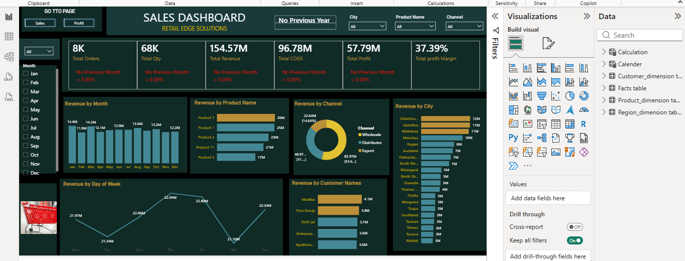
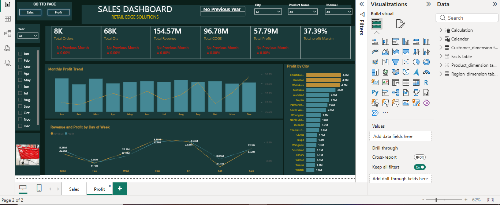

# RetailEdge Solutions Sales & Profit Dashboard

##  Project Overview

This project presents an interactive Power BI dashboard developed for **RetailEdge Solutions** to monitor and analyze sales and profit performance. The dashboard transforms raw transactional data into meaningful business insights using Power Query, DAX measures, and interactive visualizations.

The report enables decision-makers to monitor key performance indicators, identify high-performing products and cities, analyze sales trends, and evaluate business profitability.

---

## Business Objective

The objective of this project was to build an executive dashboard that enables stakeholders to:

- Monitor sales and profit performance.
- Identify top-performing cities and products.
- Analyze monthly sales and profit trends.
- Compare revenue, costs, and profitability.
- Filter results dynamically using interactive slicers.

---

##  Dashboard Pages

### Sales Dashboard

The Sales Dashboard provides an overview of:

- Total Orders
- Total Quantity Sold
- Total Revenue
- Total Cost of Goods Sold (COGS)
- Total Profit
- Profit Margin
- Revenue by Month
- Revenue by Product
- Revenue by Channel
- Revenue by City
- Revenue by Customer

---

###  Profit Dashboard

The Profit Dashboard focuses on profitability by analyzing:

- Monthly Profit Trend
- Profit by City
- Revenue vs Profit by Day of Week
- Overall Profit Performance
- Interactive filtering by Year, City, Product and Channel

---

## Tools Used

- Microsoft Power BI
- Power Query
- DAX
- Data Modeling
- Data Visualization

---

##  Key Insights

- Generated over **154.57M** in revenue.
- Achieved **57.79M** in total profit.
- Maintained a profit margin of **37.39%**.
- Revenue varied across products, cities, and sales channels.
- Interactive filtering allows dynamic business analysis.

---

##  Skills Demonstrated

- Data Cleaning
- Data Modeling
- DAX Measures
- Power Query
- Dashboard Design
- KPI Reporting
- Interactive Visualizations
- Business Intelligence

---

##  Project Files

- `retailedge-sales-dashboard.pbix`
- `sales-dashboard.PNG`
- `profit-dashboard.PNG`

---

## About Me

I'm **Amaka**, a Mathematics graduate transitioning into Data Analytics. I'm passionate about transforming raw data into actionable insights using Excel, Power BI, and SQL. I'm continuously building practical analytics projects to strengthen my skills and create business value.

---

⭐ If you found this project interesting, feel free to explore my other repositories and connect with me.
